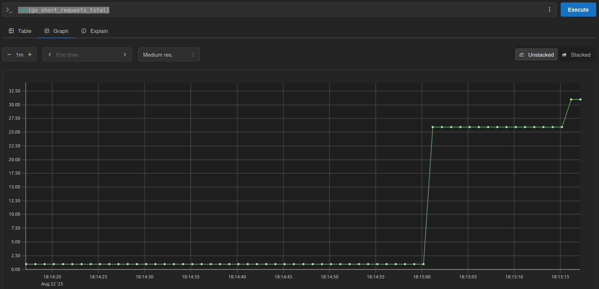
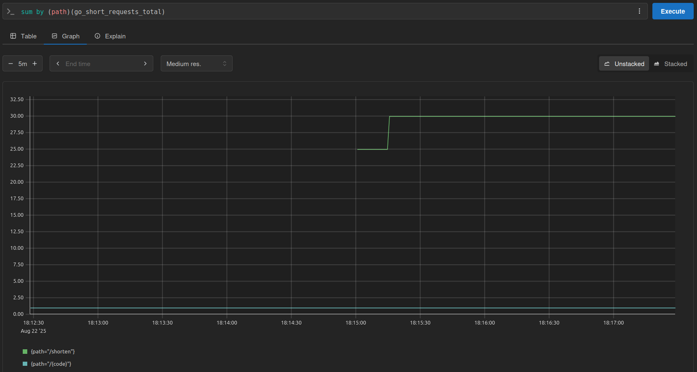
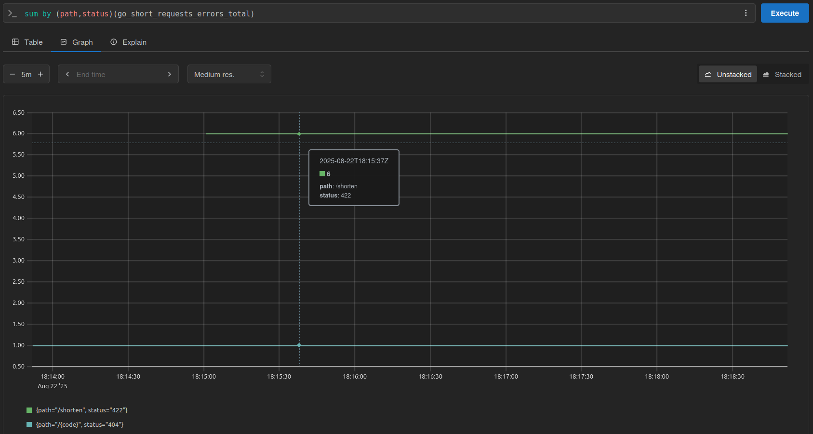
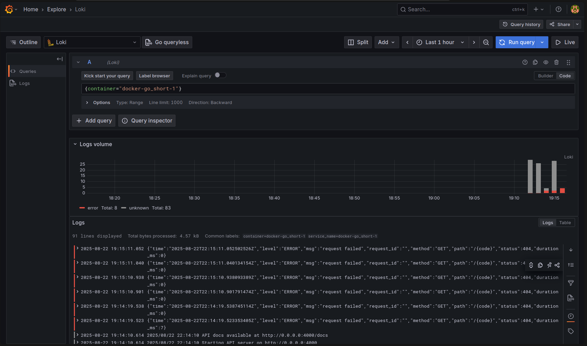
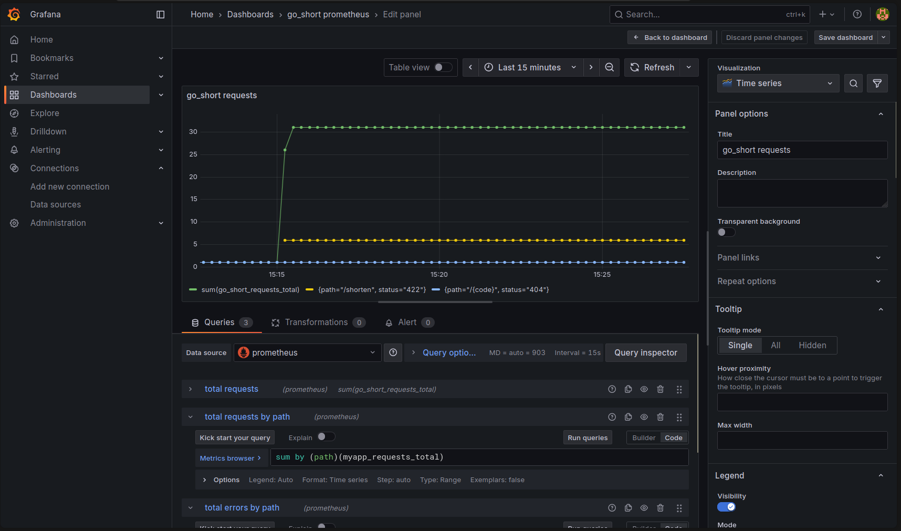

# go_short

A URL shortener service built with Go, featuring a clean architecture with comprehensive test coverage.

## AI Usage

AI was used in this project to create tests, add comments and generate documentation, speeding up scaffolding time.

## Features

- URL shortening with customizable short codes
- URL resolution with redirects
- In-memory & PostgreSQL storage (extensible to other storage backends)
- RESTful API with Go's servemux
- Fully documented API thanks to huma
- Comprehensive test suite with >80% coverage
- Benchmark tests for performance monitoring
- Centralized configuration management

## Dependencies

- golang >= 1.24.4
- air >= v1.62.0 (install with `go install github.com/air-verse/air@latest`)
- make
- docker & docker compose (optional)
- kubernetes (optional)

## Commands

### Development

```sh
make run_compose_dev_api # requires docker and docker compose to be installed
# or
make run_dev_api # runs cmd/api/main.go with air for hot reload
# or
make run_api # runs cmd/api.main.go with go run, will fail if you don't have postgres running
```

### Building

```sh
make build_api
```

### Testing

```sh
make test_unit         # Run unit tests only
make test_e2e          # Run Integration tests only
make test              # Run all tests
make test_coverage     # Run tests with coverage report
make test_benchmark    # Run benchmark tests
```

### Cleanup

```sh
make clean
```

## API Docs

API docs are avaiable at http://localhost:4000/docs

## K8s

See [./k8s/README.md](./k8s/README.md)

## Prometheus

If running with docker compose, you should find the prometheus GUI at http://localhost:9090, you may execute any query for the counters `go_short_requests_total` or `go_short_requests_errors_total` (both defined in [middleware/prometheus.go](./internal/api/middleware/prometheus.go)).

### Examples

#### sum(go_short_requests_total)



#### sum by (path)(myapp_requests_total)



#### sum by (path,status)(go_short_requests_errors_total)



## Promtail + Loki

If running with docker compose, both Promtail and Loki should be running and fetching logs from all docker containers running, you may change this by editing the file [.docker/promtail.yaml](.docker/promtail.yaml#18) and changing the `regex` property under `relabel_configs`, under `scrape_configs`, to `.*go_short.*` in order to get only those matching the Go app.

### Example getting all logs from go_short



## Grafana

If running with docker compose, you should find the grafana GUI at http://localhost:3000 (default credentials are `admin:admin`).



## Architecture

The application follows a clean architecture pattern:

```
cmd/
├── api/          # API server entry point
└── cli/          # CLI entry point

internal/
├── api/          # HTTP handlers and routing
├── shortener/    # Business logic for URL shortening
├── storage/      # Data persistence layer
├── model/        # Data models
└── config/       # Configuration management
```
